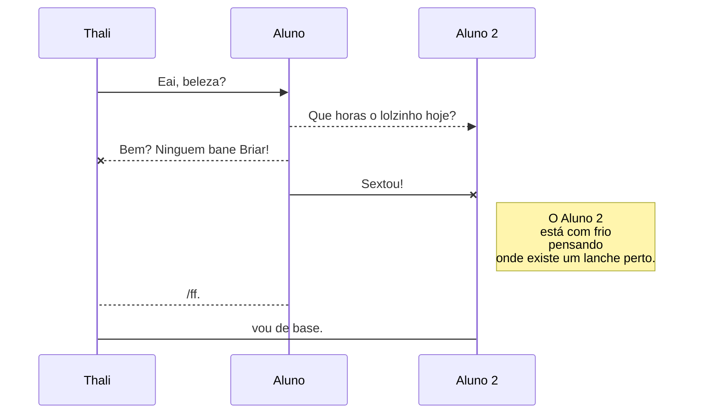
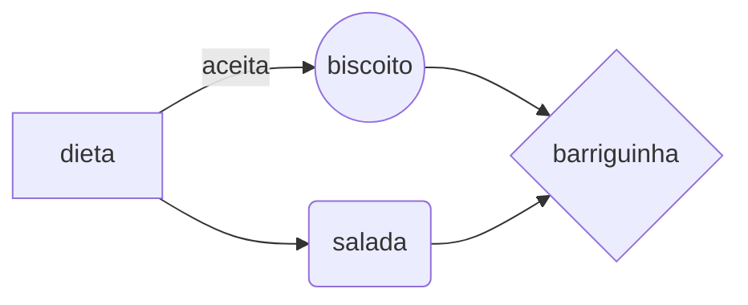

# Escrita de títulos
Confira a seguir algumas formas de escrita de títulos de documentos técnicos.

# Título 1
O título 1 é determinado por # e utilizado para títulos com o maior nível de destaque dentro de um documento técnico.

**Exemplo:** Receita de bolo de cenoura

## Título 2
O título 2 é determinado por ## e utilizado para títulos sobre assuntos relacionados ao título 1 dentro de um documento técnico.

**Exemplo:** Ingredientes do bolo

### Título 3
O título 3 é determinado por ### e utilizado para títulos sobre assuntos relacionados ao título 2 dentro de um documento técnico.

**Exemplo:** Ingredientes para a massa e ingredientes para a cobertura.

# Escrita de parágrafos e descrições
No Markdown, existem algumas marcações utilizadas para escritas de parágrados e descrições, que são:
- Negrito: o negrito é feito utilizando o símbolo ** antes e depois do trecho desejado. Exemplo: **destaque**.
- Itálico: o itálico é feito utilizando o símbolo * antes e depois do trecho desejado. Exemplo: *palavra estrangeira*.
- Link: o link para referências externas é feito no seguinte formato: [texto que será exibido na tela] (url-para-link). Exemplo: [Google](www.google.com)
- Código: os trechos de códigos são referênciados pelo símbolo \` antes e depois do trecho desejado. 

Exemplo:
`trecho de código de linha única`

```
trecho de código 
com mais de uma linha
```

- Imagem: as imagens são refenciadas no seguinte formato: ! [texto alternativo] (caminho-relativo-ou-url-da-imagem). Exemplo:


# Formatos adicionais
Além da escrita de parágrafos, é possível criar alguns recursos no Markdown com formatos específicos. Que são:

## Tabelas
As tabelas possuem um formato com pipelines, espaços e traços para sua formatação. Para facilitar o dia-a-dia, você pode usar o [Markdown Table Generator](https://www.tablesgenerator.com/markdown_tables).

Exemplo de tabela:

| coluna 1 | coluna 2 | coluna 3 |
|----------|----------|----------|
| info 1   | info 2   | info 3   |
| info 4   | info 5   | info 6   |

## Diagrams UML
Os diagramas em markdown são criados utilizando uma extensão chamada [Mermaid]() que permite fazer alguns tipos de fluxo utilizando a linguagem de marcação. Confira a seguir alguns exemplos.

### Diagrama de sequência




O Mermaid é uma extensão do Markdown que geralmente precisa ser inserida nos templates de documentação com alguma configuração.


### Fluxo


## Formulas matemáticas
O markdown pode renderizar formulas matemáticas utilizando a extensão KateX, que são expressões matemáticas do fomato LateX. 
```
$$
\Gamma(z) = \int_0^\infty t^{z-1}e^{-t}dt\,.
$$
```
